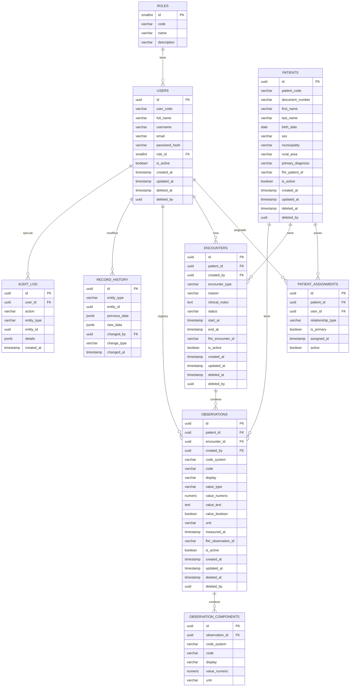

# Diagrama entidad-relación

```mermaid
erDiagram

    ROLES ||--o{ USERS : tiene

    USERS ||--o{ PATIENT_ASSIGNMENTS : asignado
    PATIENTS ||--o{ PATIENT_ASSIGNMENTS : posee

    PATIENTS ||--o{ ENCOUNTERS : tiene
    USERS ||--o{ ENCOUNTERS : crea

    PATIENTS ||--o{ OBSERVATIONS : tiene
    ENCOUNTERS ||--o{ OBSERVATIONS : contiene
    USERS ||--o{ OBSERVATIONS : registra

    OBSERVATIONS ||--o{ OBSERVATION_COMPONENTS : contiene

    USERS ||--o{ RECORD_HISTORY : modifica
    USERS ||--o{ AUDIT_LOG : ejecuta

    ROLES {
        smallint id PK
        varchar code
        varchar name
        varchar description
    }

    USERS {
        uuid id PK
        varchar user_code
        varchar full_name
        varchar username
        varchar email
        varchar password_hash
        smallint role_id FK
        boolean is_active
        timestamp created_at
        timestamp updated_at
        timestamp deleted_at
        uuid deleted_by
    }

    PATIENTS {
        uuid id PK
        varchar patient_code
        varchar document_number
        varchar first_name
        varchar last_name
        date birth_date
        varchar sex
        varchar municipality
        varchar rural_area
        varchar primary_diagnosis
        varchar fhir_patient_id
        boolean is_active
        timestamp created_at
        timestamp updated_at
        timestamp deleted_at
        uuid deleted_by
    }

    PATIENT_ASSIGNMENTS {
        uuid id PK
        uuid patient_id FK
        uuid user_id FK
        varchar relationship_type
        boolean is_primary
        timestamp assigned_at
        boolean active
    }

    ENCOUNTERS {
        uuid id PK
        uuid patient_id FK
        uuid created_by FK
        varchar encounter_type
        varchar reason
        text clinical_notes
        varchar status
        timestamp start_at
        timestamp end_at
        varchar fhir_encounter_id
        boolean is_active
        timestamp created_at
        timestamp updated_at
        timestamp deleted_at
        uuid deleted_by
    }

    OBSERVATIONS {
        uuid id PK
        uuid patient_id FK
        uuid encounter_id FK
        uuid created_by FK
        varchar code_system
        varchar code
        varchar display
        varchar value_type
        numeric value_numeric
        text value_text
        boolean value_boolean
        varchar unit
        timestamp measured_at
        varchar fhir_observation_id
        boolean is_active
        timestamp created_at
        timestamp updated_at
        timestamp deleted_at
        uuid deleted_by
    }

    OBSERVATION_COMPONENTS {
        uuid id PK
        uuid observation_id FK
        varchar code_system
        varchar code
        varchar display
        numeric value_numeric
        varchar unit
    }

    RECORD_HISTORY {
        uuid id PK
        varchar entity_type
        uuid entity_id
        jsonb previous_data
        jsonb new_data
        uuid changed_by FK
        varchar change_type
        timestamp changed_at
    }

    AUDIT_LOG {
        uuid id PK
        uuid user_id FK
        varchar action
        varchar entity_type
        uuid entity_id
        jsonb details
        timestamp created_at
    }
```
